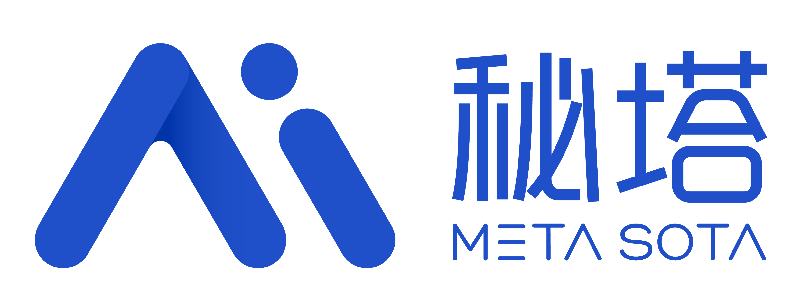
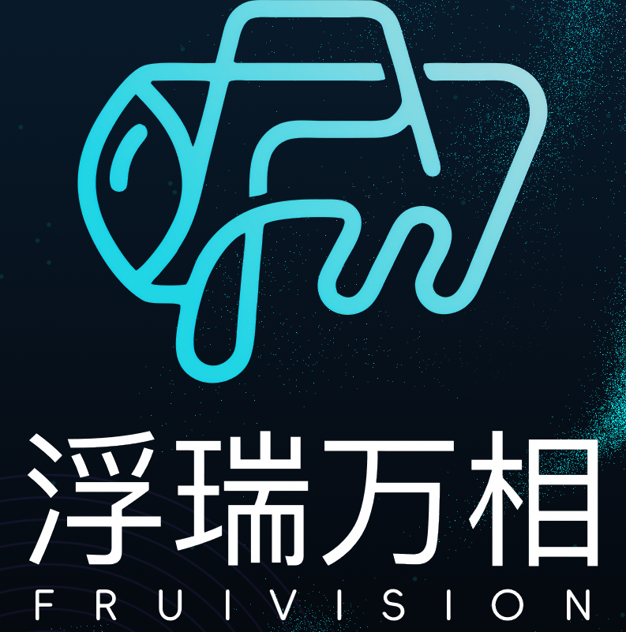
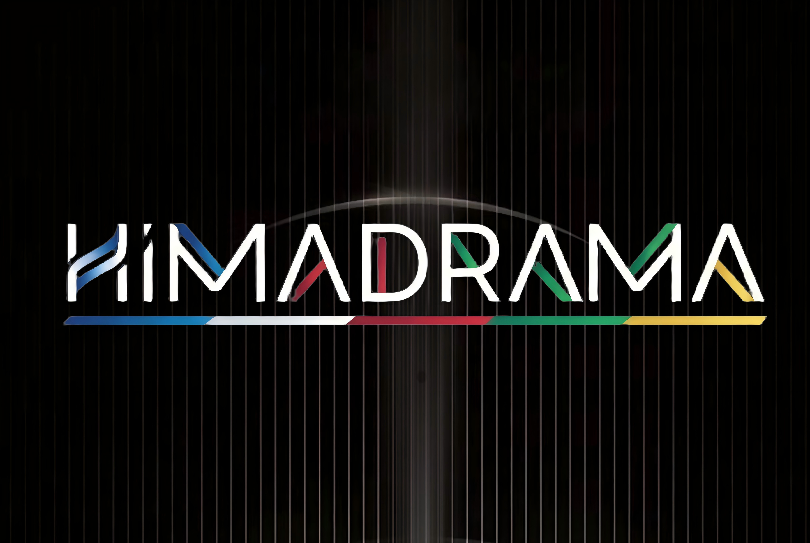
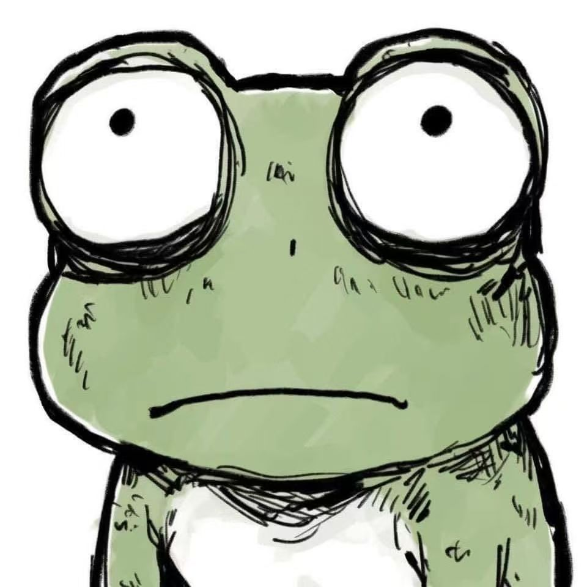

<p align="center">
  
</p>

<h1 align="center">巨天</h1>

<p align="center">让一个故事，从文字走向银幕</p>

<p align="center">
  <a href="https://github.com/ddcat-ai/open-ai-canvas">GitHub</a> ·
  <a href="docs/content/docs/overview/features.mdx">功能</a> ·
  <a href="docs/content/docs/overview/quick-start.mdx">文档</a> ·
  <a href="SECURITY.md">安全策略</a>
</p>

巨天是一个开源的 AI 影视与短剧创作工作台。它把自由画布、结构化分镜、角色与风格资产、图片/视频/音频生成、异步任务和本地 Agent 放在同一条创作链路里，让创作者从文字 brief 走到可复用的镜头资产。

> 项目仍在快速开发，数据结构和外部接口可能直接调整。默认适合个人、本地或可信环境部署；未经安全配置，不要直接作为公网多人服务使用。

演示环境：[https://ddcat.pronhubcn.com](https://ddcat.pronhubcn.com)

- 账号：`test`
- 密码：`test123456`

## 赞助商

感谢以下赞助商对巨天项目的支持：

| LOGO | 类型 | 赞助商名称 | 说明 | 网站 |
| --- | --- | --- | --- | --- |
|  | 商业 | ArtDance | 本项目 Seedance 模型的天使投资人。 | [artbox.top](https://artbox.top) |
|  | 团队 | 快乐机艺术小组 | 一支跨学科的艺术创作团队，持续探索数字与艺术的全新表达形式。 | 暂无 |
|  | 企业 | 秘塔 | 提供 MiniMax H3 视频生成 API，支持原生 2K、音画同步和 OpenAI 兼容协议。 | [metaso.cn](https://metaso.cn/minimax-h3/?s=dd) |
|  | 企业 | 浮瑞万相AI | 一家专注于AI视听的AI Native公司 | 暂无 |
|  | 团队 | 喜马抓马 | 中国AI视听先锋厂牌/AI 视听全链路综合服务平台 | [himadrama.com](https://himadrama.com) |

## 贡献者与团队

感谢参与产品设计、开发、测试、内容和社区建设的成员：

| 头像 | 昵称 | 邮箱 | 个性签名 |
| --- | --- | --- | --- |
|  | 爱笑的毛毛虫<br><sub>用户名：sikongyue</sub> | [315515767@qq.com](mailto:315515767@qq.com) | 正在啃 main 分支，争取下次 merge 的时候变成蝴蝶 |
|  | delve-s | [3013141136@qq.com](mailto:3013141136@qq.com) | 我亦无他，惟手熟尔 |
|  | CyrusAuyeung | [cyrusauyeungho@gmail.com](mailto:cyrusauyeungho@gmail.com) | HKUST(GZ) UG |
|  | 奶大佬 | [1304634970@qq.com](mailto:1304634970@qq.com) | 人生就是要不断的探索 |
|  | dyh | [1613203335@qq.com](mailto:1613203335@qq.com) | 无 |
|  | kyori | [1771634408@qq.com](mailto:1771634408@qq.com) | 励志成为未来最好用的画布仓库的贡献者 |
|  | Bowen | [admin@bowen.games](mailto:admin@bowen.games) | 剑走偏峰，雷厉风行。 |
|  | ken | [2506802@qq.com](mailto:2506802@qq.com) | 走自己的路 |
|  | fish | [cihai.sea@gmail.com](mailto:cihai.sea@gmail.com) | AI 界热于助人的拖油瓶 |
|  | QAyong<br><sub>ID：QAyong<br>B站：QAyong</sub> | [2110491559@qq.com](mailto:2110491559@qq.com) | AI 短剧合规，资产确权 |
|  | _K37ix. | [2773843782@qq.com](mailto:2773843782@qq.com) | Making things that think |
|  | Rou | [rou325089@163.com](mailto:rou325089@163.com) | 上善若水 |

## 交流与反馈

Issue 反馈、技术讨论和产品升级建议都可以在 QQ 群中沟通。群内还会不定期组织 AI 学习与培训交流会。

<p align="center">
  
  
</p>

## 当前能力

- **自由画布**：项目、节点、连线、框选、缩放、小地图、撤销重做、导入导出和公开只读分享。
- **影视工作流**：剧本、角色、场景、风格板、参考素材、结构化分镜和 3D 导演台。
- **多媒体生成**：文本、图片、视频、音频任务，支持参考图、首尾帧、运镜、视频续写、局部修改和批量生成。
- **任务与素材**：后端异步队列、任务日志、取消/重试、账号素材库、资源引用校验和登录后的跨设备同步。
- **Agent 协作**：画布助手、本地 Canvas Agent、MCP 工具、Codex App 插件和技能库。
- **管理与渠道**：系统渠道、逻辑模型、用量/积分、功能开关、对象存储、响应拦截和管理后台。

详细功能清单见 [`docs/content/docs/overview/features.mdx`](docs/content/docs/overview/features.mdx)，实现入口见 [`docs/content/docs/backend/code-map.mdx`](docs/content/docs/backend/code-map.mdx)。

## 架构概览

```text
浏览器（web/）
  ├─ React 工作区、画布、任务中心、素材库
  ├─ localForage/Zustand 本地状态与降级缓存
  └─ request.ts / channel relay
          │ 登录态 JSON、SSE、资源请求
          ▼
后端（backend/）
  ├─ Gin handler -> service -> repository/model
  ├─ SQLite（本地）或 PostgreSQL + Redis（部署）
  ├─ 异步任务 worker、资源存储、权限和模型中转
  └─ provider/outbound -> 外部模型渠道

本地 Agent（canvas-agent/） <-> 浏览器画布 <-> Codex MCP / 本机 CLI
Codex 插件（`plugins/yingce/`）负责把 MCP 接入 Codex App。
```

前端默认把 `/api` 代理到 `http://127.0.0.1:8080`；生产环境由网页容器的 Nginx 代理到后端，只有 web 的 `3000` 端口需要对外暴露。系统模型和文本任务的 SSE 只在明确的流式路径关闭代理缓冲，详见 [`nginx.conf`](nginx.conf) 和 [SSE 文档](docs/content/docs/overview/docker.mdx)。

## 本地开发

### 环境

- Bun（前端和文档站）
- Go 1.25（后端）
- Node.js 18+（Canvas Agent）
- 如使用 Docker 开发，需要 Docker Compose

### 宿主机启动

```bash
git clone https://github.com/ddcat-ai/open-ai-canvas.git
cd open-ai-canvas

# 开发数据必须使用 Git 忽略的目录，不要直接使用 backend/data
mkdir -p .local/project-workbench-debug .local/cache/go-build .local/cache/go-mod

# 终端一：后端
cd backend
CANVAS_BACKEND_DATA_DIR=../.local/project-workbench-debug go run ./cmd/server

# 终端二：前端
cd ../web
bun install
bun run dev
```

Windows PowerShell 用户也可以在仓库根目录执行一键启动脚本：

```powershell
.\scripts\start-local.ps1
```

脚本会使用 `.local/project-workbench-debug` 作为后端开发数据目录，并分别打开前后端窗口。缺少 `web/node_modules` 时会自动执行 `bun install --frozen-lockfile`。详细说明见 [`本地开发`](docs/content/docs/backend/local-development.mdx)。

打开 <http://localhost:3000>，注册第一个管理员账号，再在设置中配置模型渠道。前端的 Vite 配置会把 `/api` 代理到本机 `8080`。

如需修改代理目标，设置 `VITE_API_PROXY_TARGET`；如生产前端与后端不共源，构建时设置 `VITE_CANVAS_BACKEND_URL`。用户的模型 Base URL、API Key 和模型名保存在浏览器本地，真实密钥只应发送到可信且启用 HTTPS 的自部署后端。

### Docker 开发和本地构建

源码热更新（Vite HMR + Air）：

```bash
LOCAL_UID=$(id -u) LOCAL_GID=$(id -g) \
  docker compose -f docker-compose.dev.yml up --build
```

本地构建前后端 release 镜像：

```bash
docker compose -f docker-compose.local.yml up -d --build
```

两种方式都使用容器内的数据卷；源码热更新编排额外绑定 `.local/project-workbench-debug`，避免 Compose 静默创建另一套开发账号数据。端口冲突时可通过 `CANVAS_WEB_HOST_PORT`、`CANVAS_BACKEND_HOST_PORT` 覆盖开发端口。

### 私网模型和本机渠道

后端默认拒绝本机、私网和链路本地模型地址。开发时只为可信主机设置精确白名单：

```bash
CANVAS_ALLOWED_PRIVATE_UPSTREAM_HOSTS=192.168.1.10
```

不要用 `CANVAS_ALLOW_PRIVATE_UPSTREAMS=true` 代替白名单。桌面本机渠道是另一项能力，只有后端绑定 `127.0.0.1:8080` 且设置 `CANVAS_DESKTOP_LOCAL_CHANNELS_ENABLED=true` 才会生效，云端和 Docker 默认不会获得该能力。

## 服务器部署

### 一键源码构建（推荐）

适用于 Linux 云服务器。脚本会安装 Docker，拉取源码，生成受保护的 `.env`，构建网页/后端镜像并启动 PostgreSQL、Redis、后端和网页：

```bash
curl -fsSL https://raw.githubusercontent.com/ddcat-ai/open-ai-canvas/main/scripts/install-server.sh | sudo bash
```

默认访问 `http://服务器IP:3000`。第一个注册账号会成为管理员；公开注册默认关闭。更新或排查：

```bash
cd /opt/open-ai-canvas
sudo docker compose --env-file .env \
  -f docker-compose.deploy.yml -f docker-compose.build.yml ps
sudo docker compose --env-file .env \
  -f docker-compose.deploy.yml -f docker-compose.build.yml logs -f --tail=200
```

### 直接使用 GHCR 镜像

服务器不需要源码时可使用镜像脚本：

```bash
curl -fsSL https://raw.githubusercontent.com/ddcat-ai/open-ai-canvas/main/scripts/install-server-image.sh | sudo bash
```

容器包不可匿名拉取时，先通过 `GHCR_USERNAME` 和 `GHCR_TOKEN` 登录 GHCR。需要固定版本或端口时，在 `/opt/open-ai-canvas/.env` 中设置 `CANVAS_IMAGE_TAG`、`CANVAS_HTTP_PORT` 后重新启动。

### 公网必做事项

- 先在受控网络注册首个管理员，再开放公网入口；保持 `CANVAS_REGISTRATION_ENABLED=false`。
- 设置准确的 `CANVAS_CORS_ORIGINS`，不要在公网使用 `*`。
- 使用 HTTPS，并保留反向代理的 `Host`、`X-Forwarded-For`、`X-Forwarded-Proto`。
- 只对 `/api/tasks/:id/text-events` 和系统模型事件流路径关闭缓冲、缓存和 gzip；不要把 SSE 配置复制给所有 `/api/` 请求。
- 限制 `.env`、数据库、PostgreSQL/Redis 数据卷、上传目录、备份和 `.settings-key` 的权限；数据卷不等于备份。
- 后端 `8080` 留在 Compose 网络内，不要直接暴露到公网。

具体 Nginx/Caddy 示例和断线恢复方式见 [`docs/content/docs/overview/docker.mdx`](docs/content/docs/overview/docker.mdx)。

## 数据和安全边界

- 画布、项目、任务和素材登录后同步到后端；浏览器 `localForage` 仍承担缓存和后端不可用时的降级存储。
- 本地默认使用 SQLite；部署 Compose 使用 PostgreSQL 和 Redis。多实例 PostgreSQL 模式需要 `REDIS_URL` 用于限流、并发和熔断协调。
- 媒体资源可使用后端数据目录、阿里云 OSS 或腾讯云 COS。资源长期引用使用 `resource:<id>`，删除素材前会检查业务引用。
- 用户 API Key 不应出现在 URL、日志、错误上报或服务端长期明文存储中；使用真实 Key 前确认部署可信且链路为 HTTPS。
- 自定义渠道经后端 `/api/ai/custom` 中转；默认 SSRF 防护拒绝本机和私网目标，可信开发主机必须显式白名单。

安全问题请按 [`SECURITY.md`](SECURITY.md) 报告，不要在公开 Issue 中粘贴密钥、Cookie、数据库或生产日志。

## Canvas Agent 和 Codex 插件

本地 Agent 用来连接网页画布与本机 Codex/CLI：

```bash
npx -y @ddcat666/open-ai-canvas-agent
```

仓库内开发构建：

```bash
cd canvas-agent
npm install
npm run build
node dist/index.js
```

启动后将终端输出的 Local URL 和 Connect token 填入画布右上角 Agent 面板。Agent 默认只监听 `127.0.0.1`，token 不应写入 URL、日志或任务正文。完整 MCP 工具、Codex App 插件安装和本地安全边界见 [`canvas-agent/README.md`](canvas-agent/README.md) 与 [`plugins/yingce/README.md`](plugins/yingce/README.md)。

## 验证命令

项目不会在每次修改后自动执行验证；按改动范围手动运行：

```bash
# 前端
cd web && bun run build

# 后端
cd backend && go test ./...

# Canvas Agent
cd canvas-agent && npm test && npm run build

# 文档站
cd docs && bun run types:check
```

前端专项测试和后端集成测试较多，优先运行与改动模块相关的测试；UI 改动还应在浏览器检查关键路由、主题、弹窗、滚动和空态。验证结果必须在提交或交付说明中如实记录。

## 文档导航

- [快速开始](docs/content/docs/overview/quick-start.mdx)
- [功能介绍](docs/content/docs/overview/features.mdx)
- [代码功能地图](docs/content/docs/backend/code-map.mdx)
- [本地开发](docs/content/docs/backend/local-development.mdx)
- [数据库结构](docs/content/docs/backend/backend-database.mdx)
- [画布操作手册](docs/content/docs/canvas/canvas-node-manual.mdx)
- [插件系统](docs/content/docs/plugins/plugin-system.mdx)
- [待办与待测试](docs/content/docs/progress/todo.mdx) · [待测试清单](docs/content/docs/progress/pending-test.mdx)
- [更新日志](CHANGELOG.md) · [贡献指南](CONTRIBUTING.md) · [上游声明](NOTICE)

根目录 [`AGENTS.md`](AGENTS.md) 约束协作方式；`docs/index.md` 是面向 AI 的文档索引。

## 许可证和上游

本项目采用 [MIT](LICENSE) 协议。巨天基于 [basketikun/infinite-canvas](https://github.com/basketikun/infinite-canvas) 的早期版本进行二次开发，上游作者和贡献者保留其对应代码的权利与署名。
